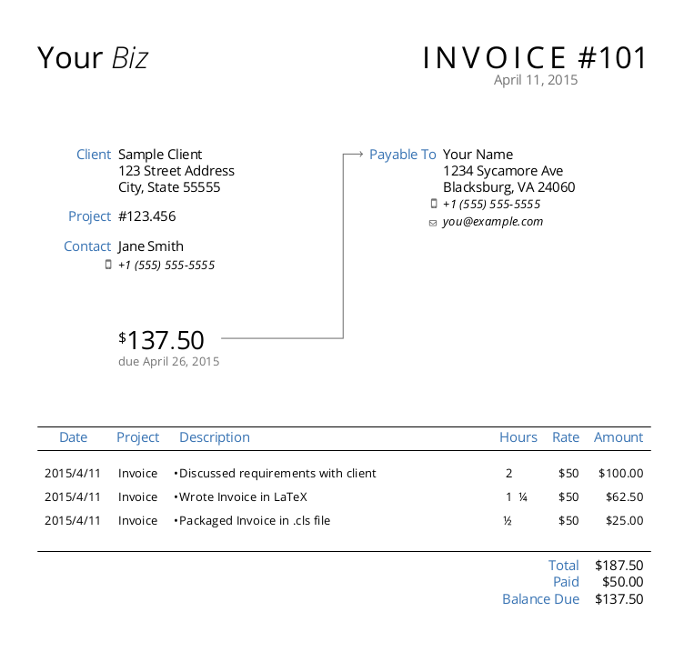
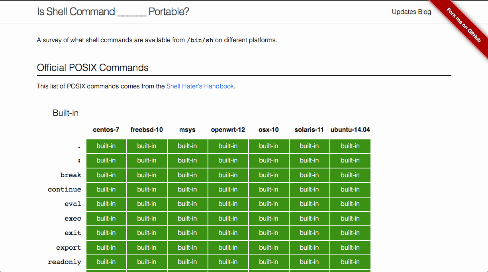
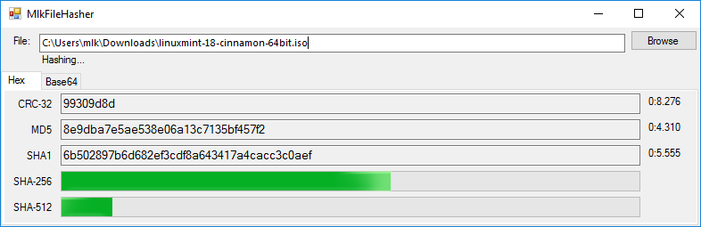

Some stuff I've worked on:

  

    
  

  

    <h4><a href="https://github.com/mkropat/dapper-invoice">Dapper Invoice</a></h4>
    
billable-time invoice template featuring style over substance

  

  

    
  

  

    <h4><a href="http://www.codetinkerer.com/is-shell-portable/">Is Shell Command __ Portable?</a></h4>
    
a survey of what shell commands are available from <tt>/bin/sh</tt> on different platforms

  

  

    <a href="https://github.com/mkropat/jumpapp">
      <pre><code>Usage: jumpapp [OPTION]... COMMAND [ARG]...

Jump to (focus) the first open window for an application, if it's running.
Otherwise, launch COMMAND (with opitonal ARGs) to start the application.

Options:
-r -- cycle through windows in reverse order
-f -- force COMMAND to launch if process found but no windows found
-n -- do not fork into background when launching COMMAND
-p -- always launch COMMAND when ARGs passed
      (see Argument Passthrough in man page)
-L -- list matching windows for COMMAND and quit
-t NAME -- process window has to have NAME as the window title
-c NAME -- find window using NAME as WM_CLASS (instead of COMMAND)
-i NAME -- find process using NAME as the command name (instead of COMMAND)
-w -- only find the applications in the current workspace</code></pre>
    </a>
  

  

    <h4><a href="https://github.com/mkropat/jumpapp">jumpapp</a></h4>
    
run-or-raise application switcher for any X11 desktop

  

  

    
  

  

    <h4><a href="https://github.com/mkropat/MlkFileHasher">MlkFileHasher</a></h4>
    
simple, stand-alone file hashing utility for Windows

  

  

    <a href="https://github.com/mkropat/MlkPwgen">
      <pre><code>PS > 1..5 | foreach { New-Password }
xVs7tYANfs
FGQ4hF29Oe
QHffH4QRUE
ai1AaBqSMe
Dd7cnAG8a8
PS > New-Password -Lower -Upper
HccNubILPl
PS > New-Password -Digits -Length 6
470114
PS > New-Password -Lower -Upper -Digits -Symbols
y3iF(g(xUw
PS > 1..5 | foreach { New-PronounceablePassword }
NaternNeam
LumLictles
StZattlate
InfeHascal
Tighampers</code></pre>
    </a>
  

  

    <h4><a href="https://github.com/mkropat/MlkPwgen">MlkPwgen</a></h4>
    
secure random password generator for .NET and PowerShell

  

  

    <a href="https://github.com/mkropat/sh-realpath">
      <pre><code>$ source ./realpath.sh
$ realpath /proc/self
/proc/2772

$ cd /tmp
$ mkdir -p somedir/targetdir somedir/anotherdir
$ ln -s somedir somedirlink
$ ln -s somedir/anotherdir/../anotherlink somelink
$ ln -s targetdir/targetpath somedir/anotherlink
$ realpath .///somedirlink/././anotherdir/../../somelink
/tmp/somedir/targetdir/targetpath</code></pre>
    </a>
  

  

    <h4><a href="https://github.com/mkropat/sh-realpath">sh-realpath</a></h4>
    
a portable, pure shell implementation of realpath

  

  

    <a href="https://github.com/mkropat/sslfie">
      <pre><code>Usage: sslfie [OPTION]... DOMAIN [DOMAIN2]...

Generate a self-signed x.509 certificate for use with SSL/TLS.

Options:
  -o PATH -- output the cert to a file at PATH
  -k PATH -- output the key to a file at PATH
  -K PATH -- sign key at PATH (instead of generating a new one)
  -c CC   -- country code listed in the cert (default: XX)
  -s SIZE -- generate a key of size SIZE (default: 2048)
  -y N    -- expire cert after N years (default: 10)
  -p      -- prompt for cert values
  -r      -- output csr instead of signing a cert</code></pre>
    </a>
  

  

    <h4><a href="https://github.com/mkropat/sslfie">SSLfie</a></h4>
    
generate self-signed x.509 certificates for use with SSL/TLS

  

### Other Projects

- [BetterWin32Errors](https://github.com/mkropat/BetterWin32Errors) — a better interface to the constants defined in winerror.h
- [jumpthere.vim](https://github.com/mkropat/vim-jumpthere) — lightweight project switcher for Vim
- [luks-mount](https://github.com/mkropat/luks-mount) — teach mount(8) to open LUKS containers
- [`shpy`](https://github.com/mkropat/shpy) — spies and stubs for shell unit testing
- [standalone-dovecot-imap](https://github.com/mkropat/standalone-dovecot-imap) — keep a local IMAP mirror, painlessly
- [uniformity.vim](https://github.com/mkropat/vim-uniformity) — convert indentation+whitespace across a project to be consistent

### Presentations

- [C#: What's a dynamic?](/presentation-whats-a-dynamic/)
- [Chef Workshop: Getting Started With Chef](/presentation-chef-workshop/)
- [Database Versioning: It Doesn't Have To Be Hard](/presentation-db-versioning/)
- [JavaScript: The Why And How Of Strict Mode](/presentation-js-strict-mode/)

### Snippets

<h4>C#</h4>

- [ArtificialStackTraceException.cs](https://gist.github.com/mkropat/afc501468d669c97f027b52c3adc10b5) — when you need a stack trace but you don't need to `throw`
- [KeyValueConfigStore.cs](https://gist.github.com/mkropat/abf0f1235f0c76034733) — simple windows registry interface
- [MicroLog.cs](https://gist.github.com/mkropat/efa2b76272f900774f27) — C# logging micro-framework
- [Migrate-Db.ps1](https://gist.github.com/mkropat/1ba7ffd1d14f55f63fb3) — run schema migration scripts on a SQL Server databse
- [NanoLog.cs](https://gist.github.com/mkropat/8111690ee4b6fce62620) — C# logging nano-framework

#### Javascript

- [require.js](https://gist.github.com/mkropat/c25ef5fc57d75a042868e6a160c175cf) — `require(...)` npm dependencies from the browser console
- [ui-router-logging.js](https://gist.github.com/mkropat/6de4e1dc3a9577789917) — automatic trace logging of Angular.js events and ui-router state transitions

#### *nix

- [csv2json](https://gist.github.com/mkropat/1fdde16aafe3b769bd1b) — convert `.csv` files into `.json` files
- [mkgitconfig](https://gist.github.com/mkropat/473c5515477e2eb7e008) — sensible Git defaults
- [tun0](https://gist.github.com/mkropat/5b3031fbc35f464ebea8) — openVPN integration with `interfaces(5)`

#### PowerShell

- [EnvPaths.psm1](https://gist.github.com/mkropat/c1226e0cc2ca941b23a9) — functions for manipulating `$env:PATH`
- [Get-WebFile.ps1](https://gist.github.com/mkropat/16c5cf675faf29140e76ca72f0b4c0cf) — download a file and verify its integrity

#### Python

- [getuser.py](https://gist.github.com/mkropat/7559409) — lookup user id and name from the source (read: no environmental variables consulted). Cross-platform compatible (Windows, *nix).
- [knownpaths.py](https://gist.github.com/mkropat/7550097) — Python wrapper around the `SHGetKnownFolderPath` Windows Shell function

#### Windows

- [autoupdate.bat](https://gist.github.com/mkropat/d0f6135d1e754a16b980) — hands-off script to fully patch a fresh Windows install
- [delete-temp-aspnet.ps1](https://gist.github.com/mkropat/8eaf13fb3dc76f4b7626) — delete all files in `Temporary ASP.NET Files` at boot
- [DeleteQueue.bat](https://gist.github.com/mkropat/8d385f15936876ac151d) — fast-delete the files in the delete queue
- [Get-AssemblyReverseReferences.ps1](https://gist.github.com/mkropat/fa8b03dbcff8b9184b20) — what .dll's are referencing this .dll (and which version)?
- [Get-WindowsSDKConstant.ps1](https://gist.github.com/mkropat/d8b744c994eaa59493648f8795d9dde8) — calculate the value for any constant in the Windows SDK
- [maintain-links.ps1](https://gist.github.com/mkropat/fa0bc9179c0610b84543) — automatically maintain shortcuts to files in subdirectories
- [measure-lines.ps1](https://gist.github.com/mkropat/c7741d92fb3ab580f332) — find files with the most lines of code in a project
