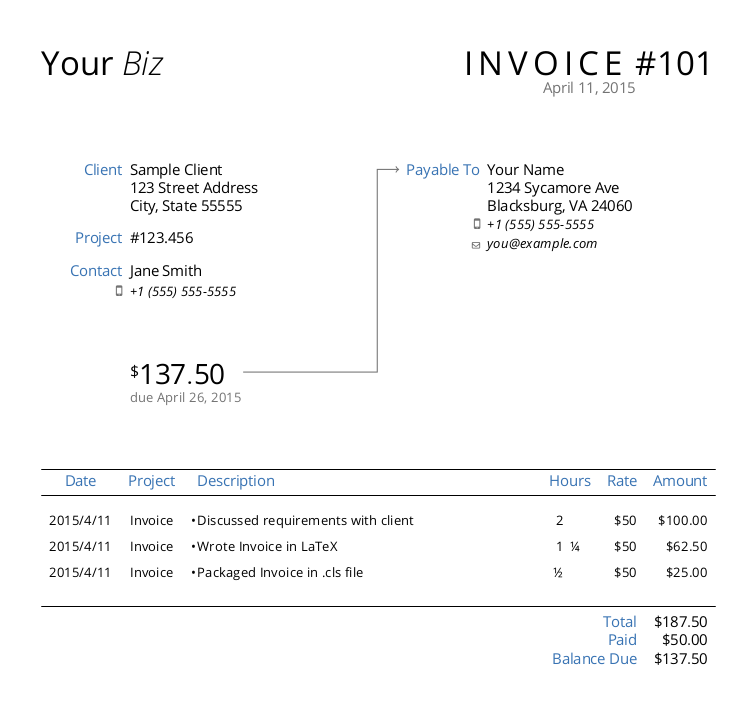
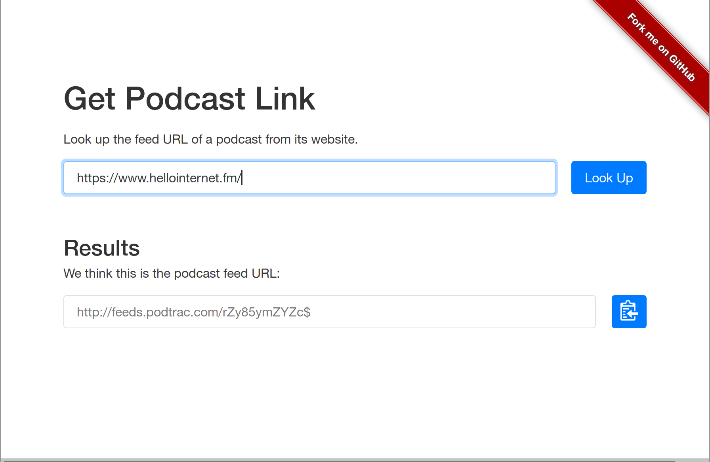
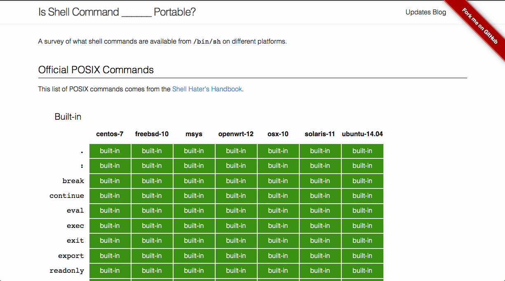
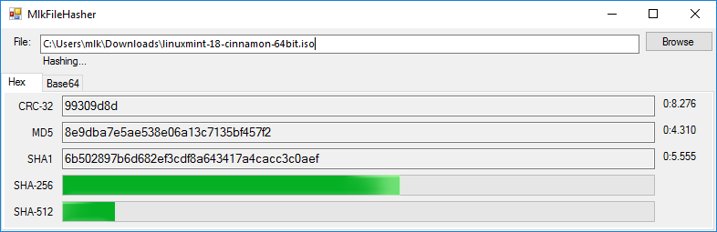
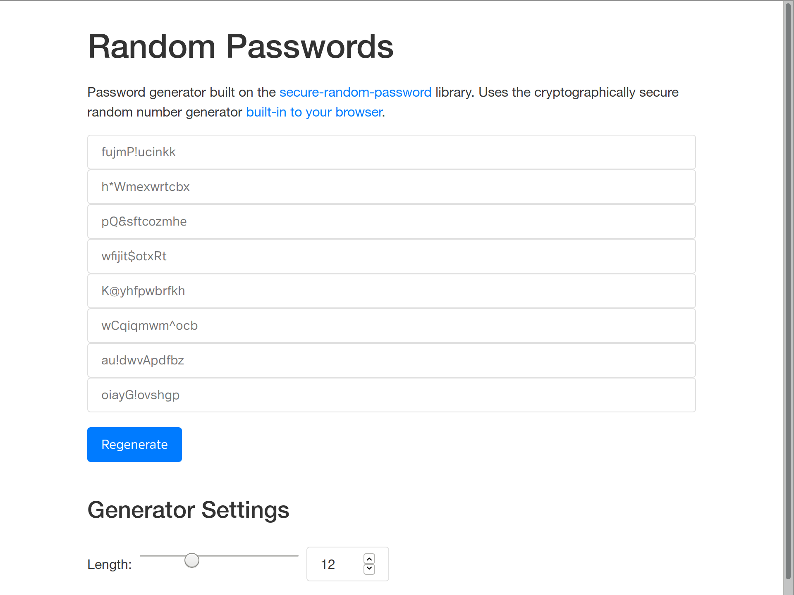
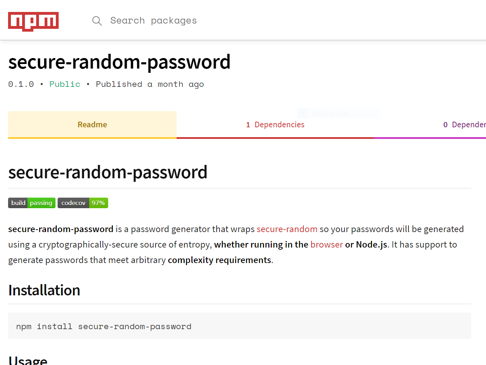

Some stuff I've published:

  

    
  

  

    <h4><a href="https://github.com/mkropat/dapper-invoice">Dapper Invoice</a></h4>
    
billable-time invoice template featuring style over substance

  

  

    
  

  

    <h4><a href="https://www.codetinkerer.com/podcast/">Get Podcast Link</a></h4>
    
look up the feed URL given an iTunes or website link

  

  

    
  

  

    <h4><a href="https://www.codetinkerer.com/is-shell-portable/">Is Shell Command __ Portable?</a></h4>
    
a survey of what shell commands are available from <tt>/bin/sh</tt> on different platforms

  

  

    <a href="https://github.com/mkropat/jumpapp">
      <pre><code>Usage: jumpapp [OPTION]... COMMAND [ARG]...

Jump to (focus) the first open window for an application, if it's running.
Otherwise, launch COMMAND (with opitonal ARGs) to start the application.

Options:
-r -- cycle through windows in reverse order
-f -- force COMMAND to launch if process found but no windows found
-n -- do not fork into background when launching COMMAND
-p -- always launch COMMAND when ARGs passed
      (see Argument Passthrough in man page)
-L -- list matching windows for COMMAND and quit
-t NAME -- process window has to have NAME as the window title
-c NAME -- find window using NAME as WM_CLASS (instead of COMMAND)
-i NAME -- find process using NAME as the command name (instead of COMMAND)
-w -- only find the applications in the current workspace</code></pre>
    </a>
  

  

    <h4><a href="https://github.com/mkropat/jumpapp">jumpapp</a></h4>
    
run-or-raise application switcher for any X11 desktop

  

  

    
  

  

    <h4><a href="https://github.com/mkropat/MlkFileHasher">MlkFileHasher</a></h4>
    
simple, stand-alone file hashing utility for Windows

  

  

    <a href="https://github.com/mkropat/MlkPwgen">
      <pre><code>PS > 1..5 | foreach { New-Password }
xVs7tYANfs
FGQ4hF29Oe
QHffH4QRUE
ai1AaBqSMe
Dd7cnAG8a8
PS > New-Password -Lower -Upper
HccNubILPl
PS > New-Password -Digits -Length 6
470114
PS > New-Password -Lower -Upper -Digits -Symbols
y3iF(g(xUw
PS > 1..5 | foreach { New-PronounceablePassword }
NaternNeam
LumLictles
StZattlate
InfeHascal
Tighampers</code></pre>
    </a>
  

  

    <h4><a href="https://github.com/mkropat/MlkPwgen">MlkPwgen</a></h4>
    
secure random password generator for .NET and PowerShell

  

  

    
  

  

    <h4><a href="https://www.codetinkerer.com/passwords/">Random Passwords</a></h4>
    
in-browser password generator built on <a href="https://www.npmjs.com/package/secure-random-password">secure-random-password</a>

  

  

    
  

  

    <h4><a href="https://www.npmjs.com/package/secure-random-password">secure-random-password</a></h4>
    
secure random password generator for the browser / Node.js

  

  

    <a href="https://github.com/mkropat/sh-realpath">
      <pre><code>$ source ./realpath.sh
$ realpath /proc/self
/proc/2772

$ cd /tmp
$ mkdir -p somedir/targetdir somedir/anotherdir
$ ln -s somedir somedirlink
$ ln -s somedir/anotherdir/../anotherlink somelink
$ ln -s targetdir/targetpath somedir/anotherlink
$ realpath .///somedirlink/././anotherdir/../../somelink
/tmp/somedir/targetdir/targetpath</code></pre>
    </a>
  

  

    <h4><a href="https://github.com/mkropat/sh-realpath">sh-realpath</a></h4>
    
a portable, pure shell implementation of realpath

  

  

    <a href="https://github.com/mkropat/sslfie">
      <pre><code>Usage: sslfie [OPTION]... DOMAIN [DOMAIN2]...

Generate a self-signed x.509 certificate for use with SSL/TLS.

Options:
  -o PATH -- output the cert to a file at PATH
  -k PATH -- output the key to a file at PATH
  -K PATH -- sign key at PATH (instead of generating a new one)
  -c CC   -- country code listed in the cert (default: XX)
  -s SIZE -- generate a key of size SIZE (default: 2048)
  -y N    -- expire cert after N years (default: 10)
  -p      -- prompt for cert values
  -r      -- output csr instead of signing a cert</code></pre>
    </a>
  

  

    <h4><a href="https://github.com/mkropat/sslfie">SSLfie</a></h4>
    
generate self-signed x.509 certificates for use with SSL/TLS

  

  

    
  

  

    <h4><a href="https://github.com/mkropat/TidyDesktopMonster">Tidy Desktop Monster</a></h4>
    
prevent shortcuts from cluttering your Windows desktop ever again

  

### Other Projects

- [BetterWin32Errors](https://github.com/mkropat/BetterWin32Errors) — a better interface to the constants defined in winerror.h
- [jumpthere.vim](https://github.com/mkropat/vim-jumpthere) — lightweight project switcher for Vim
- [luks-mount](https://github.com/mkropat/luks-mount) — teach mount(8) to open LUKS containers
- [`shpy`](https://github.com/mkropat/shpy) — spies and stubs for shell unit testing
- [Snippets](snippets) — a selected list of code snippets I've published
- [standalone-dovecot-imap](https://github.com/mkropat/standalone-dovecot-imap) — keep a local IMAP mirror, painlessly
- [Talks](talks) — list of some talks I've given
- [uniformity.vim](https://github.com/mkropat/vim-uniformity) — convert indentation+whitespace across a project to be consistent
